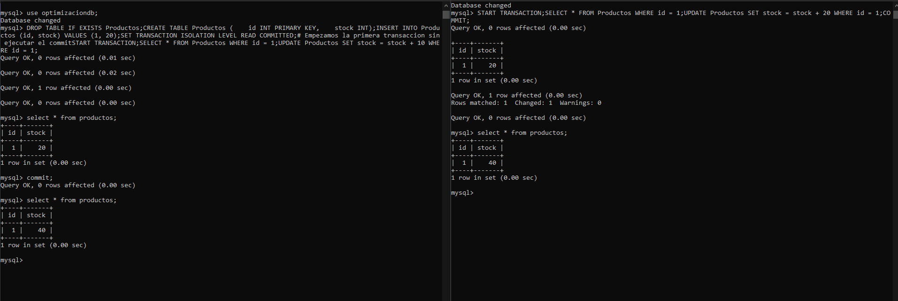
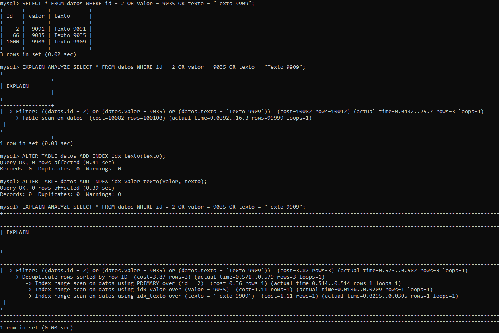
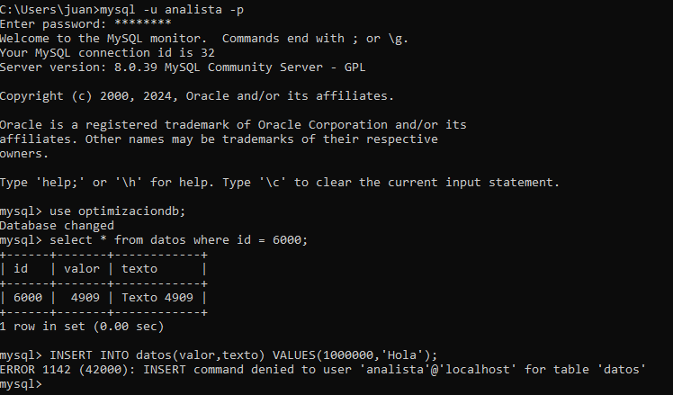
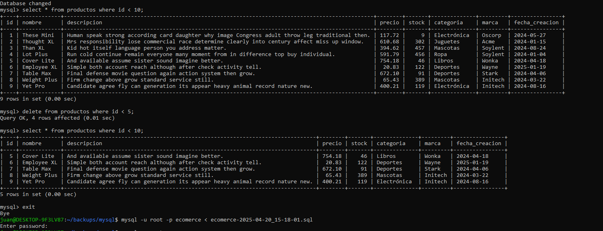

# TP 1

### Ejercicio 1 Reglas de Integridad:

Dado un modelo de base de datos de una universidad, identificar violaciones posibles a la integridad
referencial si se elimina un estudiante con cursos inscritos. ¿Que mecanismos usarias para evitarlo?

```sql
CREATE DATABASE IF NOT EXISTS universidad;
USE universidad;

CREATE TABLE IF NOT EXISTS estudiantes (
	id INT PRIMARY KEY,
    nombre VARCHAR(100)
);

CREATE TABLE IF NOT EXISTS matriculas (
    id INT PRIMARY KEY,
    id_estudiante INT,
    curso VARCHAR(100),
    FOREIGN KEY (id_estudiante) REFERENCES Estudiantes(id)
    ON DELETE RESTRICT
);
```

Usariamos `ON DELETE RESTRICT` para evitar que se elimine un estudiante con cursos inscritos.


### Ejercicio 2: Implementación de Restricciones

Crear una tabla Matriculas con restricciones de clave foranea( creada arriba ). Luego, insertar datos que violen la integridad y mostrar el error generado.

```sql
INSERT INTO Matriculas (id, id_estudiante, curso) VALUES (1, 99, 'SQL');
```

> 09:52:58	INSERT INTO Matriculas (id, id_estudiante, curso) VALUES (1, 99, 'SQL')	Error Code: 1452. Cannot add or update a child row: a foreign key constraint fails (`universidad`.`matriculas`, CONSTRAINT `matriculas_ibfk_1` FOREIGN KEY (`id_estudiante`) REFERENCES `estudiantes` (`id`) ON DELETE RESTRICT)	0.000 sec


### Ejercicio 3: Concurrencia
Simular una situación donde dos usuarios intentan actualizar el mismo saldo de una cuenta bancaria.
Analizar cómo afectan las condiciones de aislamiento (READ COMMITTED vs SERIALIZABLE).

```sql
DROP TABLE IF EXISTS Productos;
CREATE TABLE Productos (
    id INT PRIMARY KEY,
    stock INT
);
INSERT INTO Productos (id, stock) VALUES (1, 20);

SET TRANSACTION ISOLATION LEVEL READ COMMITTED;
# Empezamos la primera transaccion sin ejecutar el commit
START TRANSACTION;
SELECT * FROM Productos WHERE id = 1;

UPDATE Productos SET stock = stock + 10 WHERE id = 1;

# Al mismo tiempo ejecutamos la segunda transaccion con el commit
START TRANSACTION;
SELECT * FROM Productos WHERE id = 1;
UPDATE Productos SET stock = stock + 20 WHERE id = 1;
COMMIT;

# Debería haber perdida de datos de la primera transaction y el stock quedaría en 40.
```


Ahora con `SERIALIZABLE`

```sql
DROP TABLE IF EXISTS Productos;
CREATE TABLE Productos (
    id INT PRIMARY KEY,
    stock INT
);
INSERT INTO Productos (id, stock) VALUES (1, 20);

SET TRANSACTION ISOLATION LEVEL SERIALIZABLE;
# Empezamos la primera transaccion sin ejecutar el commit
START TRANSACTION;
SELECT * FROM Productos WHERE id = 1;

UPDATE Productos SET stock = stock + 10 WHERE id = 1;

# Al mismo tiempo ejecutamos la segunda transaccion con el commit
START TRANSACTION;
SELECT * FROM Productos WHERE id = 1;
UPDATE Productos SET stock = stock + 20 WHERE id = 1;
COMMIT;
```


### Ejercicio 4: Plan de Ejecución
Usar una base de datos con más de 100,000 registros. Ejecutar una consulta sin  ́ındice y luego con ındice. Usar EXPLAIN para comparar rendimiento.

```sql
DROP TABLE IF EXISTS Datos;
CREATE TABLE Datos (
    id INT PRIMARY KEY AUTO_INCREMENT,
    valor INT,
    texto VARCHAR(50)
);

# Insertar 100,000 registros usando JOINs sobre la tabla Numbers
INSERT INTO Datos (valor, texto)
SELECT (a.num + b.num*10 + c.num*100 + d.num*1000 + e.num*10000) AS n,
       CONCAT('Texto ', (a.num + b.num*10 + c.num*100 + d.num*1000 + e.num*10000))
FROM Numbers a, Numbers b, Numbers c, Numbers d, Numbers e
WHERE (a.num + b.num*10 + c.num*100 + d.num*1000 + e.num*10000) BETWEEN 1 AND 100000;

# Consulta sin índice:
EXPLAIN SELECT * FROM Datos WHERE valor = 98765;

# Ahora se crea un índice en la columna "valor" para optimizar la consulta:
ALTER TABLE Datos ADD INDEX idx_valor (valor);

# Consulta con índice, se utiliza EXPLAIN para comparar el plan de ejecución:
EXPLAIN SELECT * FROM Datos WHERE valor = 98765;
```


### Ejercicio 5: Creación de  ́Indices
Diseñar una consulta que filtre por múltiples campos. Crear diferentes  ́ındices y medir cuál ofrece mejor rendimiento.

```sql
SELECT * FROM datos WHERE id = 2 OR valor = 9035 OR texto = "Texto 9909";

ALTER TABLE datos ADD INDEX idx_texto(texto);
ALTER TABLE datos ADD INDEX idx_valor_texto(valor, texto);

EXPLAIN ANALYZE SELECT * FROM datos WHERE id = 2 OR valor = 9035 OR texto = "Texto 9909";
```



### Ejercicio 6: Vistas
Crear una vista que resuma las ventas mensuales por producto. Luego, usarla en una consulta que devuelva los 5 productos más vendidos.

```sql
# Creacion tabla Ventas
DROP TABLE IF EXISTS Ventas;
CREATE TABLE Ventas (
    id INT PRIMARY KEY AUTO_INCREMENT,
    producto_id INT,
    cliente_id INT,
    fecha DATE,
    cantidad INT,
    total DECIMAL(10,2)
);

# Insertar 10,000 registros en Ventas simulando datos variados
# Se usan los JOINs de la tabla Numbers para generar datos
INSERT INTO Ventas (producto_id, cliente_id, fecha, cantidad, total)
SELECT 
  (a.num + b.num*10) % 50 + 1,                # producto_id de 1 a 50
  (a.num + b.num*10) % 100 + 1,               # cliente_id de 1 a 100
  DATE_ADD('2024-01-01', INTERVAL (a.num + b.num*10) DAY),
  ((a.num + b.num*10) % 5) + 1,               # cantidad entre 1 y 5
  ROUND(RAND() * 1000,2)                      # total aleatorio entre 0 y 1000
FROM Numbers a, Numbers b
WHERE (a.num + b.num*10) BETWEEN 1 AND 10000;
```
```sql
# Creacion tabla Productos
DROP TABLE IF EXISTS Productos;
CREATE TABLE Productos (
    id INT PRIMARY KEY AUTO_INCREMENT,
    nombre VARCHAR(100)
);

# Insertar 50 productos generados dinámicamente
INSERT INTO Productos (nombre)
SELECT CONCAT('Producto ', n)
FROM (
    SELECT (a.num + b.num*10 + 1) as n
    FROM Numbers a, Numbers b
    WHERE (a.num + b.num*10) < 50
) AS sub;
```

```sql
# Creacion Vista

DROP VIEW IF EXISTS VentasMensuales;
CREATE VIEW VentasMensuales AS
SELECT 
    producto_id,
    DATE_FORMAT(fecha, '%Y-%m') AS mes,
    SUM(cantidad) AS total_cantidad,
    SUM(total) AS total_ventas
FROM Ventas
GROUP BY producto_id, DATE_FORMAT(fecha, '%Y-%m');
```
```sql
# Consulta usando la vista:
# Se unen los datos de VentasMensuales con la tabla Productos para obtener nombres
# Luego se listan los 5 productos con mayor cantidad total vendida (en todas las fechas, o se puede filtrar por mes)
SELECT p.nombre, vm.total_cantidad, vm.mes
FROM VentasMensuales vm
JOIN Productos p ON vm.producto_id = p.id
ORDER BY vm.total_cantidad DESC
LIMIT 5;
```


### Ejercicio 7: Gestión de Permisos
Crear un usuario analista que solo pueda hacer SELECT en ciertas tablas. Intentar insertar desde
ese usuario y explicar el resultado.

```sql
CREATE USER 'analista'@'localhost' IDENTIFIED BY 'clave123';

GRANT SELECT ON optimizaciondb.Datos TO 'analista'@'localhost';

FLUSH PRIVILEGES;
```


Al querer insertar datos usando un usuario que solo puede hacer select en dicha tabla se produce un error de privilegios.

### Ejercicio 8: Seguridad y Auditoría
Simular una auditoría simple con triggers que registren toda modificación en una tabla Clientes.


```sql
# Se crean las tablas de Clientes y Auditoria de clientes
CREATE TABLE clientes (
    id INT AUTO_INCREMENT PRIMARY KEY,
    nombre VARCHAR(100),
    email VARCHAR(100) UNIQUE
);


CREATE TABLE auditoria_clientes (
    id INT AUTO_INCREMENT PRIMARY KEY,
    accion VARCHAR(10),
    cliente_id INT,
    datos_viejos JSON,
    datos_nuevos JSON,
    fecha DATETIME DEFAULT CURRENT_TIMESTAMP
);
```

```sql
# Se crea el Trigger
DELIMITER $$

CREATE TRIGGER t_auditoria_clientes
AFTER UPDATE ON clientes
FOR EACH ROW
BEGIN
    INSERT INTO auditoria_clientes (
        accion,
        cliente_id,
        datos_viejos,
        datos_nuevos
    ) VALUES (
        'UPDATE',
        OLD.id,
        JSON_OBJECT('nombre', OLD.nombre, 'email', OLD.email),
        JSON_OBJECT('nombre', NEW.nombre, 'email', NEW.email)
    );
END$$

DELIMITER ;
```

```sql
# Prueba del Trigger
INSERT INTO clientes (nombre, email) VALUES ('Lionel Messi', 'liomessi@example.com');

# Actualizar el cliente para disparar el trigger
UPDATE clientes
SET nombre = 'Lionel Andres Messi'
WHERE id = (select id from  (select id from clientes where email = 'liomessi@example.com' limit 1) as sub_clientes);
# Verifica que el id sea el mismo que el id que esta asociado al email que tambien es unico

# Consultar la tabla de auditoría
SELECT * FROM auditoria_clientes;
```


### Ejercicio 9: Backup y Restore
Documentar paso a paso cómo hacer un backup completo en MySQL o PostgreSQL y cómo restaurarlo. Simular una pérdida de datos y su posterior recuperación.

Crear un script que haga un backup de la base de datos usando
```
mysqldump -u $USER -p $PW $BASEDEDATOS > $DIRECCIONDESTINO
```

Con cron, establecer a que horario se ejecutará ese script
```
crontab -e
```

Modificar la base de datos



Traer el backup que hicimos para sobrescribir la base de datos que modificamos(mostrado en la imagen anterior)

```
mysql -u root -p ecomerce < $DIRECCIONDESTINO/ARCHIVOCREADO.sql
```

Checkear nuevamente la base de datos


